# Deacon CJ's Presentation

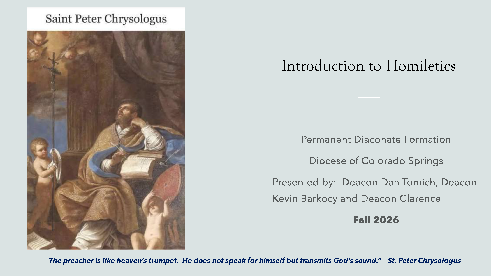
Welcome to your Deacon Formation homiletics course.
The course will be team-taught by Deacon Dan Tomich, Deacon Kevin Barkocy and me.

We originally projected that you would take an introduction to Homiletics Course during your first year of Candidacy, followed by an Advanced Course this year.
After much consideration, it made more sense to combine the courses and deliver them at one time. 
The now combined course will be presented over three Wednesday evenings in accordance with our formation schedule.
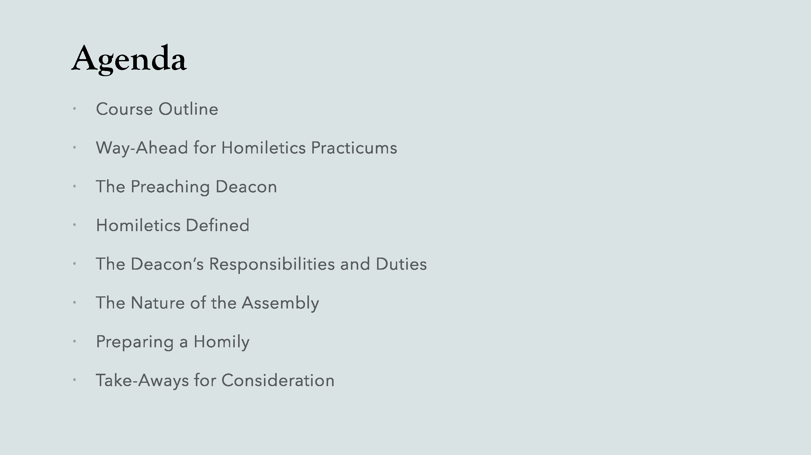
Candidates should pay particular attention to the discussion related to preparing a homily and take-aways for consideration as they begin developing their individual styles and drafting their first practice homilies
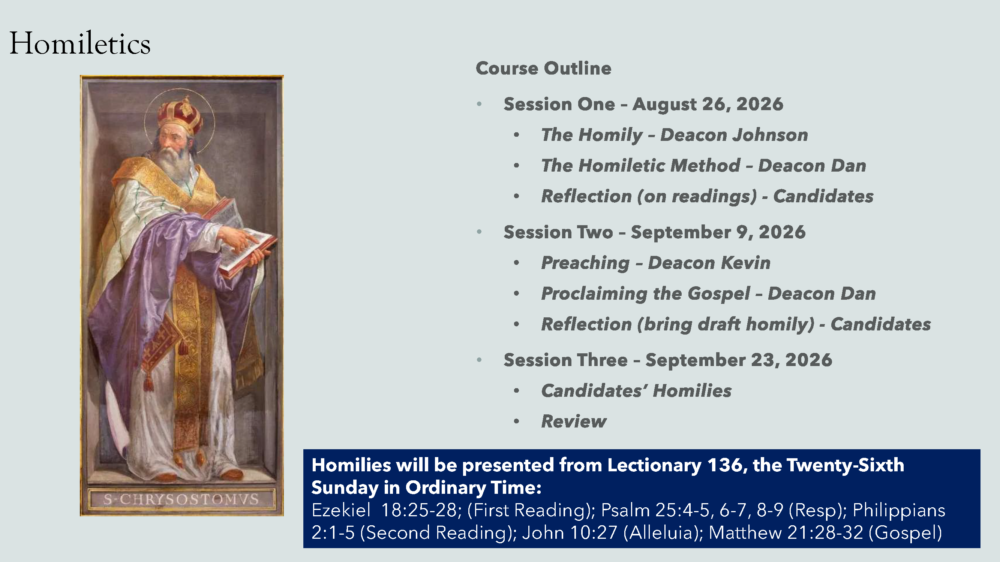
Here’s a strategic look at the topics and materials we’ll cover in this course.

I draw your attention again to the readings shared with you on 22 August 2026.
The lectionary readings for the Twenty-Sixth Sunday in Ordinary Time will inform your practice homilies you will present on Wednesday 23 September 2026.

We’ll touch more on these homilies in the coming slides.
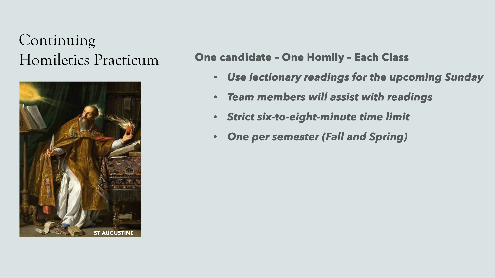
**Practice homilies** will be **useful** to you **in establishing methods for: developing quality homilies** after receiving holy orders; honing skills for **effective and repeatable homily preparation**; and of, course **inspirational delivery.**

At the completion of this mini course – for the remainder of the Academic Year -- each Candidate will be assigned dates to deliver two practice homilies (one each in the Fall and one each in the Spring each).
They will be presented as a part of standalone Lauds and Vespers liturgies or scheduled Holy Hours during which Lauds or Vespers are prayed. 
**These assignments are not a part of the 3 Session Homiletics course** you are taking now. 
Rather they will be follow-on assignments. 
Your **preaching dates are forthcoming**.

For the purposes of these practice homilies, your small group members will support your preaching by proclaiming the 1st and second readings, responsorial and Gospel acclamation.
The preaching candidate will proclaim the Gospel, as a deacon would ordinarily do during Mass. 
-- further offers opportunities for the Candidates to practice publicly proclaiming God’s Word.

Candidates will **deliver** their **homilies within a six-to-eight minute time limit**.
Cohort **peers** and formation team members **will assess** the **quality** and delivery of each homilies **utilizing the Catholic Exchange Society’s app** reviewed on 22 August 2026.
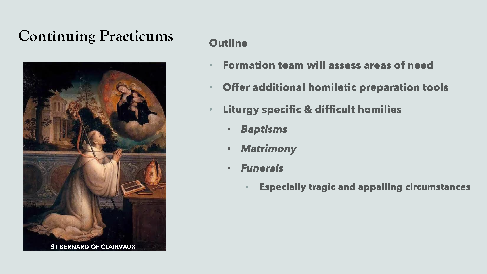
At the completion of this course, and as we progress through the remainder of your time in formation, we will assess your individual needs with respect to homily preparation and delivery and offer additional tools and techniques.

As we move into your final year of formation, we will offer you the opportunities to develop your own homilies for Baptisms, Matrimony and Funerals, which should serve you well after receiving holy orders.

**As we begin, I’d like you to think about a question.**
What in your estimation was the **best homily you’ve ever heard, or possibly the most meaningful?**
**Why?**
What made it so memorable?
Was it the message itself, the preacher’s style, or possibly the relationship of the homily to the season you were going through in your life at the time?

A great example of a homily(ies) that reached many people because of its content and the preaching style of the priest were those delivered by St. Bernard of Clairvaux (1090-1153).
He is said to have delivered deeply moving sermons on the Song of Songs.
His voice and demeanor were so compelling that his listeners would be physically and spiritually overcome – some falling into states of ecstasy as they absorbed his message.

[Commentary on the Song of Songs](https://www.themathesontrust.org/papers/christianity/StBernard-SongOfSongs-1-43-A4.pdf)

By all accounts, St. Bernard was a gifted homilist.
Admittedly his audience was different than yours will be – He preached the 86 “Sermons” on the Song of Songs to his monastic community of monks at the Abbey of Clairvaux for whom he served as abbot.
You are encouraged to read some of these to see how such a preacher deliver’s powerful messages to his community, understanding their maturity levels and their needs.

**What does it mean to preach?**

• In Mark 16:15 Our Lord issues the now famous Great Commission. 
Where He says “Go into the whole world and **proclaim (some translations read “preach”)** the gospel to every creature.”
• 4:43, Jesus said “To other towns also I must **proclaim (some translations say “preach”)** the good news of the Kingdom of God, because for this purpose I was sent”
The word preach or proclaim used in these instances is translated from the Greek, Kérusso (pronounced kay-roos-so) which means to herald (as a public crier), to proclaim, to publish or to announce a message publicly with conviction or persuasion.
Speaks to the broad sense of preaching and that the **message is not yours but from God.**
**We must cooperate with the Spirits promptings and work diligently to now let our own personal views pollute what He intends for us to deliver.**

Preparing a homily isn’t like writing a speech…or setting the stage for a personal viewpoint or argument.
It should be Spirit-inspired.
We should seek the counsel and assistance of the Holy Spirit, for as the letter to the Romans reminds us, **“He helps us in our weakness.”**
As He guides you, you’ll find that He will help you to tailor your homily to the hearers that will receive it in ways that you couldn’t even imagine.
It’s not uncommon that after I preach people will approach and say, how could you have known what I’m going through right now in my life? 
It was as if you were speaking directly to me. 
We’ll discuss this more, but your homilies should always be well-researched, and their content should always be consistent with the truths of our faith. 
**At times**, when you are led by the Spirit, you may find that your homilies have different purposes…sometimes **to encourage** and **inspire**…sometimes **to gently and lovingly correct or reprove**…sometimes to **edify**…sometimes **to convert** (when **directed at the faithful in the pews…conversion speaks to continued strengthening and growth in the faith…sometimes** it will be to **evangelize** – and when I say evangelize, I want to highlight that as you preach to the faithful during the sacred liturgy these will be people for the most part who already have a faith. 
**Here we speak of the new evangelization often spoken of by Pope JP II** where **we reach out & call for Catholics to renew their own faith** and we **reach out to those who have deep Christian roots but are now facing a crisis of faith** due to their emersion in a secular culture…but always our **preaching is rooted in God’s Word…the teachings of Jesus Christ & consistent with the dogmatic and magisterial teachings of our Church.**
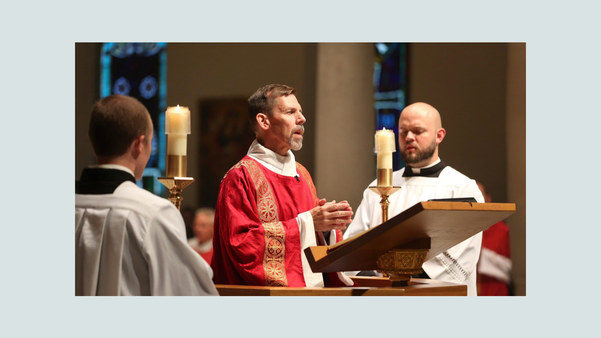
Any comments, questions or observations at this point?
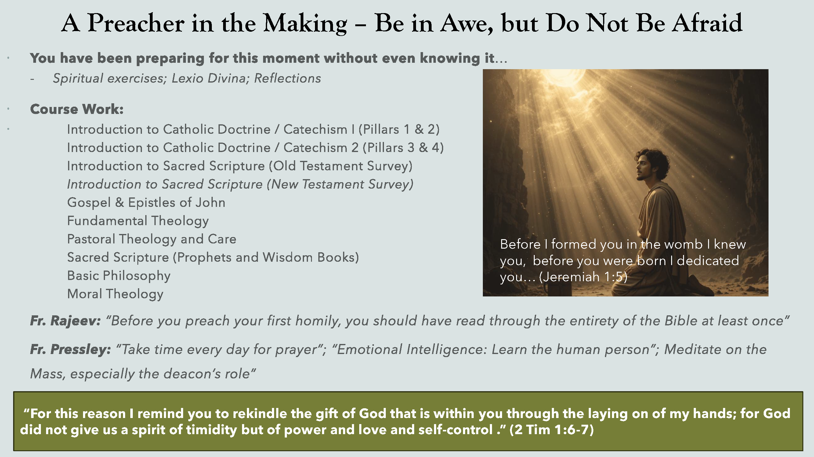
I found that as my cohort initially began delivering practice homilies, some experienced angsts. 
**I encourage you to lean into** this great opportunity and **not be afraid.** 
We of course should **be in awe that the God of all creation allows us to participate in the work of His hands** through the vocation which you are discerning.

But **be confident**, for **you have been preparing for this moment without even knowing it.** 
**Pray, prepare and trust God for the outcome.**

I want to **reemphasize something Fr. Rajeev spoke** with us **about** last year at your retreat. 
**A good preacher needs to be a lover of God’s Word.**
**I can’t say enough about the importance of your reading and devouring Sacred Scripture.**
Don’t just read it academically but **let it seep into your very being and begin to transform you from the inside out.** 
**Read, “rightly divide”, pray and live God’s Word.**
Doing so will be foundational to your preaching abilities.
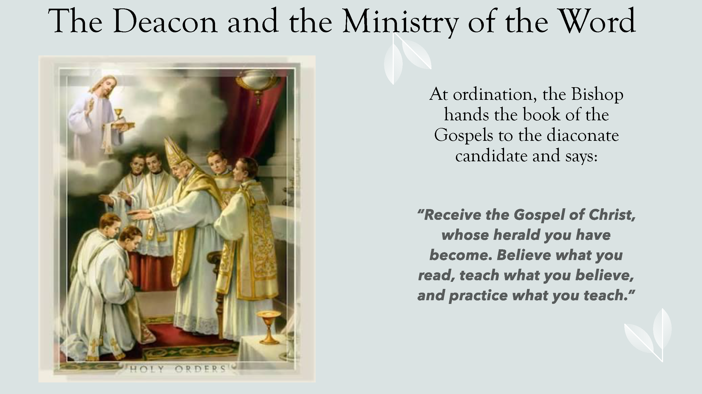
The Deacon, in cooperation with the Episcopate and Presbyterate, have a substantial responsibility in strengthening the Church's mission, animating, encouraging, and equipping the lay faithful to embrace fully the dignity and mission received in Baptism and empowering them to become missionary disciples participating in Christ's threefold office as priest, prophet, and king.
Remember, you will be ministers of the Gospel and you will help the faithful rediscover the Gospel as truly “Good News”…not as a law designed to crush the soul.
This is an awesome grace and responsibility.

You may recall in our 2025 Fall Retreat, Fr. Rajeev challenged each of you to ensure you have read through the entirety of Sacred Scripture before you begin to preach to the faithful as ordained men.
Being sensitive to what God’s Word is saying to you and His people through His Word is critical to your efficacy as a preacher, but also what His people are searching for within His Word to help them to live lives of heroic virtue and to achieve their primary vocation – the universal call to holiness. Vocation means Call.
The Second Vatican Council speaks to the fact that we are all called to be saints – God’s desired destiny for us is thus to live with Him forever in heaven – if we cooperate with His grace.
Our preaching, plain and simple, should help the faithful know Him, love Him, and serve Him in this world, and to be happy with Him forever in the next.
Useful in this endeavor is what Fr. Pressley spoke of at our recent retreat – to work to strengthen our emotional intelligence in order to better learn the human person – that is to know the needs of the people we encounter.

Don’t just read the words in Sacred Scripture, but spend time meditating on them and praying the Scriptures.
While doing so, God will speak to you from them in the silence of your heart.
This is a necessary prelude for effective preaching.

Another important facet of effective preaching is the proper interpretation of God’s Word – what we refer to as hermeneutics.
It originates from a Greek word which from the standpoint of Catholicism means the science and set of rules used to interpret Sacred Scripture and tradition.
It guides how the Church reads the Bible by balancing the human words of the authors with the divine truth of the Holy Spirit, always in harmony with the living teaching tradition of the Church.

Hermeneutics relies on Exegesis. From the Greek to “bring out”.
It calls for the use of historical, literary, linguistic, and other scholarly method, but interprets Scripture within the living Tradition of the Church and in fidelity with the faith. As you continue your studies you will begin to acquire important resource materials (Bible dictionary, a theological dictionary of Scripture, trustworthy Biblical Commentaries) and/or learn from where they can be accessed.

It’s important to understand that Church doctrine is nourished by profound meditation upon the inspired Word, the exegesis of the Church fathers, conciliar documents, and the teaching of the Magisterium.

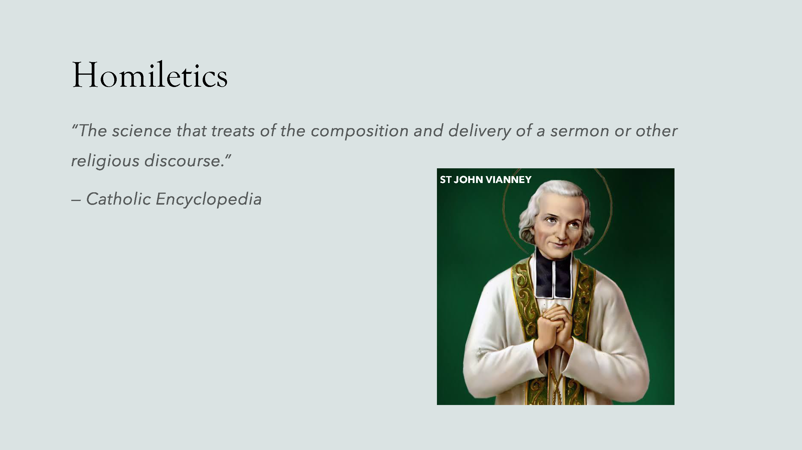
The Catholic Encyclopedia describes homiletics as including the various forms of Christian preaching, such as the sermon, homily, and catechetical instruction, and identifies it as a branch of pastoral theology.
In simple terms:
**Homiletics** = the study and practice of preparing and delivering that preaching.
Although the definition of homiletics is from the 1913 Catholic Encyclopedia, it expresses the established theological meaning of the term.
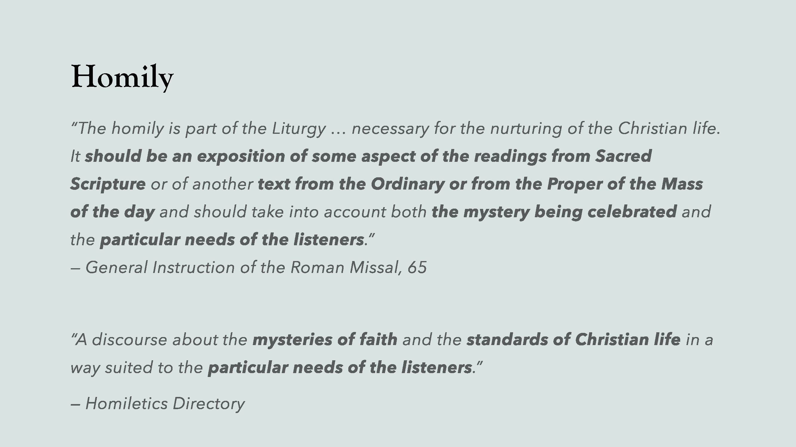
In simple terms:

**Homily** = the actual liturgical preaching delivered to the faithful (congregation) in the context of the Sacred Liturgy.
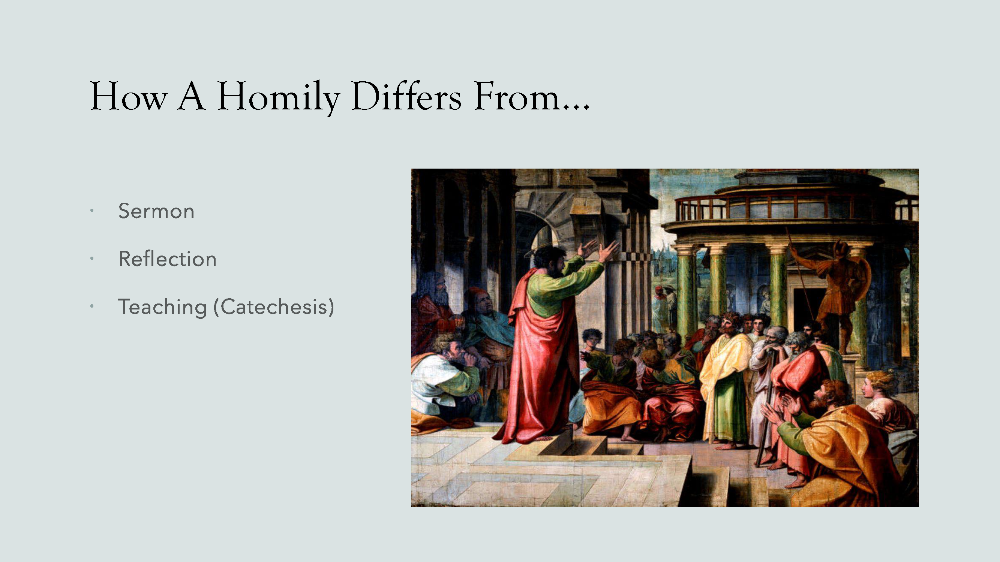
Catholic Teaching: a homily is a specific liturgical commentary tied directly to the day's Scripture, whereas a sermon, reflection, and teaching differ by their structure, setting, and who is allowed to give them.

_Homily_

**Definition:** A liturgical address given during Mass or a sacrament that explains the specific Scripture readings from the Lectionary of the day.

**Who can give it:** Strictly reserved for ordained clergy (priests, deacons, and bishops).

**Key feature:** It is an integral part of the Liturgy of the Word meant to connect the sacred text to the daily lives and needs of the local community.

_Sermon_

**Definition:** A broader, more formal religious discourse focusing on specific theological theme, moral behavior, or church doctrine, rather than being bound to the specific readings of the day.

Similar to the homily, it is based on some text found in Sacred Scripture.

**Who can give it:** Traditionally delivered by ordained ministers, though the broader term is common across various Christian traditions.

**Key feature:** It tends to be more structured, didactic (instructional), and longer than a standard Catholic homily.

_Reflection_

**Definition:** A personal, meditative sharing on a spiritual topic, a St., or a general theme of faith.

**Who can give it:** Can be delivered by laypeople, such as during community prayer (The Hours), a parish meeting, retreat, or a non-liturgical gathering.

**Key feature:** It is less formal than and shorter than a homily or sermon, sharing a personal or communal "witness" rather than an authoritative exposition of liturgical Scripture.

_Teaching (Catechesis)_

**Definition:** Systematic instruction in the doctrines, morals, and traditions of the Catholic Church (Catechesis).

**Who can give it:** Priests, deacons, catechists, and lay teachers in formal settings like RCIA, faith formation classes, or Catholic schools.

**Key feature:** Its primary goal is education and passing on the factual and spiritual deposit of the faith rather than inspiring an active worship congregation during the liturgy.
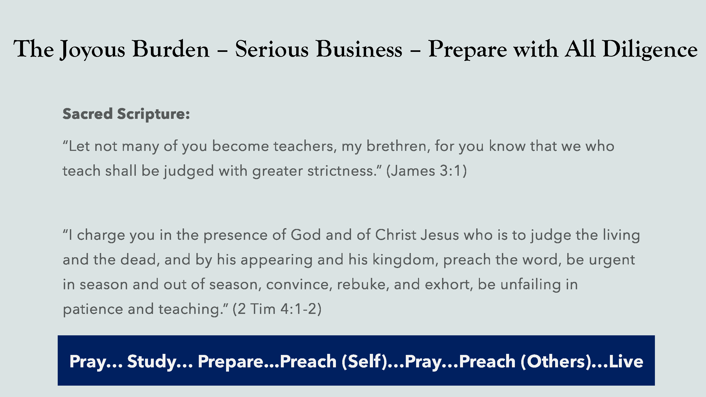
Preaching should not be approached as one may do so as they prepare a presentation or briefing for a secular job.
While there may be some similarities in terms of communicating information to listeners, the burden of responsibility and the potential to affect the lives of the faithful and their destination in eternity should be seriously considered every time you approach the Ambo.

I like to refer to preaching as a joyful burden…something about which we should be grateful that the Lord and our Bishop has entrusted us with.
And at the same time, we should grapple with the work with great care and diligence because through what we speak, we can influence the listener to the Good or we could possibly lead them astray.

We should always approach our homily prep in prayer, with diligent study and preparation.
We should never preach a homily to others that we haven’t first preached to ourselves.
St. Peter Chrysologos famously said, “Before preaching to others, I need the word to break me inside”.
As we approach the date for delivery, continue in prayer in confirmation as to what the Holy Spirit is leading you to preach.
And after preaching God’s word to His people, it is important that we live that which we preach.

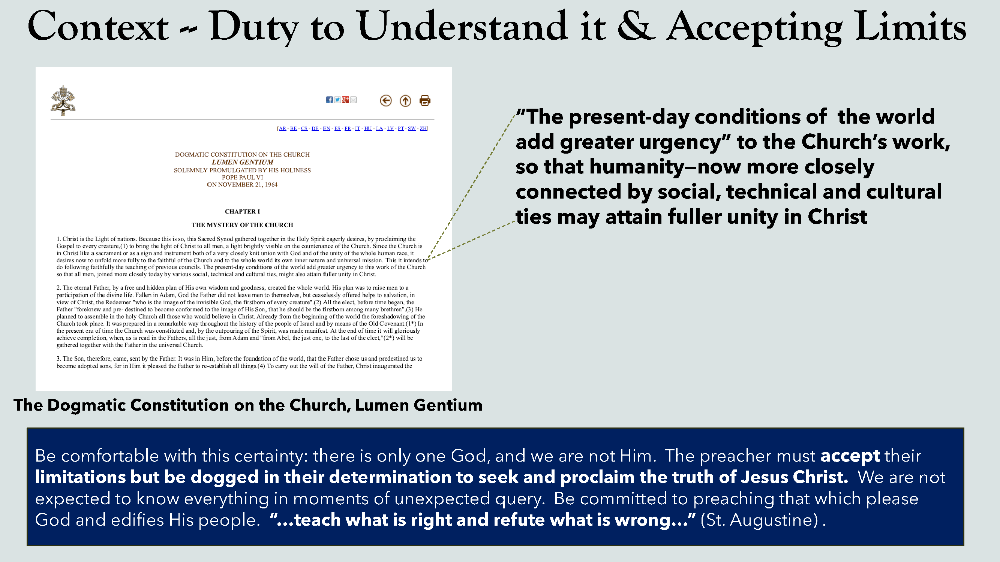
As we are called to preach to the faithful, we must recognize and achieve an understanding not only of the contemporary world in which they live and work, but also if they are to be properly inspired to fulfill their mission received in Baptism to become missionary disciples.
We must therefore become students of the world – it’s social, political and economic forces shaping it.

We must also recognize that we are not God and not expected to know everything, but that said, we should lean not to our own understanding…seek God’s help and with dogged determination seek to always proclaim the Truth of Jesus Christ – despite our limitation.

Be encouraged concerning your limitations.
The Church has a rich body of commentary and interpretative guidance through the Magisterium, the Church Fathers and Saints.

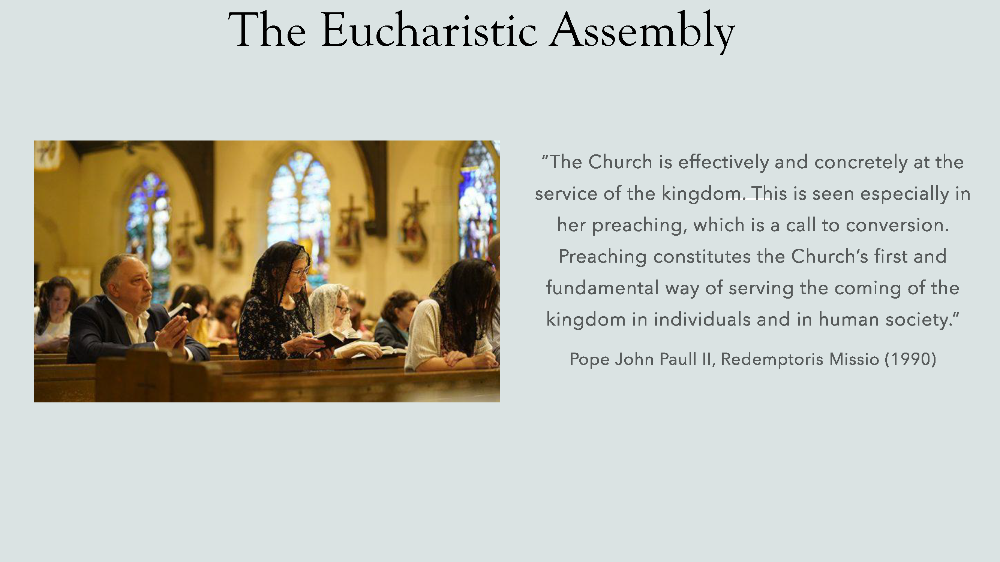
Pope John Paul II called for a new evangelization as the Church approached the millennium.
He also stressed the importance of liturgical preaching as essential to that evangelization.
“The Church is effectively and concretely at the service of the kingdom.
This is seen especially in her preaching, which is a call to conversion.
Preaching constitutes the Church’s first and fundamental way of serving the coming of the kingdom in individuals and in human society.”
Preaching is instrumental to evangelization when properly understood as aimed at the conversion of the listener.
This view of preaching has immediate consequences.
It requires, at minimum, that preachers invest themselves both in their homilies and their listeners.

In every gathering there is diversity (whether seen to the naked eye or not).
The preacher must learn and know his audience.
While words can fall upon diverse ears in different ways, what can and should be emphasized is what unites us in the mystical Body of Christ in the assembly -- the Love of Christ.
Jesus loving Himself through each of us loving each other with the love of Jesus Christ.
The preacher is uniquely positioned to speak to this unity in common purpose in the congregation, as Jesus prayed in His High Priestly Prayer in the Gospel of John Chapter 17, where He prayed not only for His disciples, but also for those who would believe in Him through their word“…so that they may all be one….”

The faithful are hungry for Christ and His Word.
When my pastor was asked frequently what He was going to preach about at Mass, his reply was always “Jesus.”
That should be our ultimate preaching objective.
To this end, the faithful need and want to hear about Him and in the process for you to do well!

Pause and see if there are comments or questions about homilies or homiletics
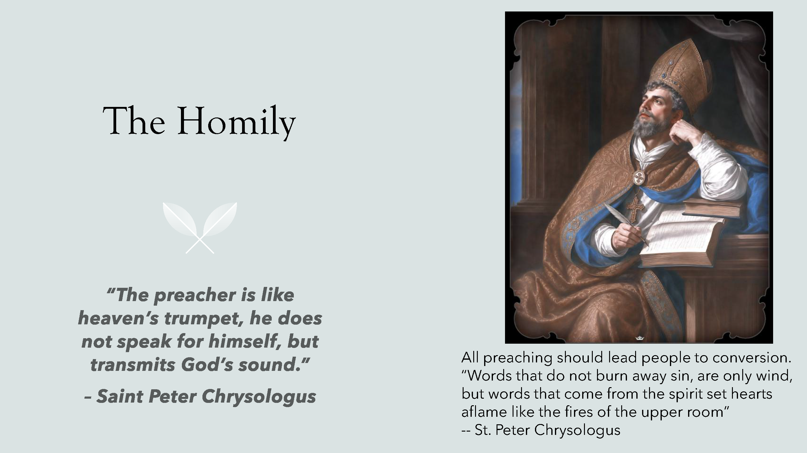
Our Church has a rich tradition in producing amazing preachers…great men like Saint John Chrysostom (Died 407 AD), Saint Augustine (whose memorial we celebrate this Friday)(354-430 AD), Saint Peter Chrysologus (Died 450 AD), and Saint Bernard of Clairvaux (1090-1153 AD) and Saint John Vianney (1786-1859 AD).
And as Deacons go, we have standouts as well: Saint Stephen, St. Philip the Evangelist, St. Vincent of Zaragosa (Died 304 AD), St. Ephrem the Syrian (Died 373 AD) and while there is debate about his ordination to the diaconate, deacons claim St. Francis of Assisi (1181-1226 AD) – a widely respected preacher of the Gospel through word and deed.

Homilies by some of these great preachers remain extant and are worth reading.
I especially draw your attention to The Christmas Homily of St. Peter Chyrsologos (Incarnation and Human Dignity - Peter Chrysologus - Crossroads Initiative) and St. Augustine’s “Sermon” 272 on the Mystery of the Real presence (St. Augustine - Sermon 272 | Christ the King Catholic Church | Nashville, TN).
Both are concise, integrated well into the liturgy, and speak to the needs of the faithful in the moment.

Developing your personal style.
It may take some time.
Be patient with yourself.
In the end, seek a style that will reach as many as you can with the Gospel and to celebrate and participate in the liturgy with faith.

If you’ve heard one preacher preach, you’ve heard one preacher preach.
Very few have the same exact style.
It’s not our intention to pigeonhole you into a single format or style.
Nor should you seek to be a carbon copy of your favorite preacher.

I personally like current day true illustrative stories or stories from the lives of saints that tie closely into the scriptures…In so doing, the people can see themselves in those spoken of and help interpret the meaning of the text.
But that might not work for you.
You have to figure out how God is choosing to best utilize you.

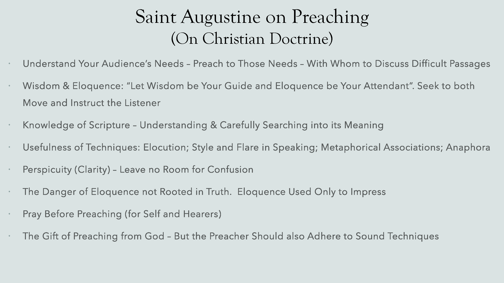
Saint Augustine began writing his great work De doctrina Christiana (On Christian Doctrine) sometime around 396 AD. He completed it nearly 30 years later in 426 AD.
Book IV of the work was dedicated to the Christian Orator.
It is rich with guidance concerning preaching and teaching the faith.
This slide and the next captures some of the highpoints from this Book which you may find useful as you shape your preaching style.

For the more he discerns the poverty of his own speech, the more he ought to draw on the riches of Scripture, so that what he says in his own words he may prove by the words of Scripture; and he himself, though small and weak in his own words, may gain strength and power from the confirming testimony of great men.

For eloquent speakers are heard with pleasure; wise speakers with profit. And, therefore, Scripture does not say that the multitude of the eloquent, but the multitude of the wise is the welfare of the world. Wisdom 6:24

Elocution: the art or style of clear, expressive, and effective public speaking.
It focuses on correct pronunciation, proper articulation, tone, breathing, and physical delivery when speaking or reading aloud

Style & Flare in Speaking: And yet here we find the figure which is called in Greek klimax (climax,) and by some in Latin gradatio, for they do not care to call it scala (a ladder), when the words and ideas have a connection of dependency the one upon the other, as we see here that patience arises out of tribulation, experience out of patience, and hope out of experience.
Another ornament, too, is found here; for after certain statements finished in a single tone of voice, which we call clauses and sections (membra et caesa), but the Greeks kpla and kommata,(1) there follows a rounded sentence (ambitus sive circuitus) which the Greeks call periodos,(2) the clauses of which are suspended on the voice of the speaker till the whole is completed by the last clause For of the statements which precede the period this is the first clause, "knowing that tribulation worketh patience;" the second, "and patience, experience;" the third, "and experience, hope."
Then the period which is subjoined is completed in three clauses, of which the first is, "and hope maketh not ashamed;" the second, "because the love of God is shed abroad in our hearts;" the third, "by the Holy Ghost which is given unto us."
But these and other matters of the same kind are taught in the art of elocution.
As then I do not affirm that the apostle was guided by the rules of eloquence, so I do not deny that his wisdom naturally produced, and was accompanied by, eloquence.

Diacope: The rhetorical and literary term for repeating a word or phrase with one or more intervening words breaking it up is **diacope**

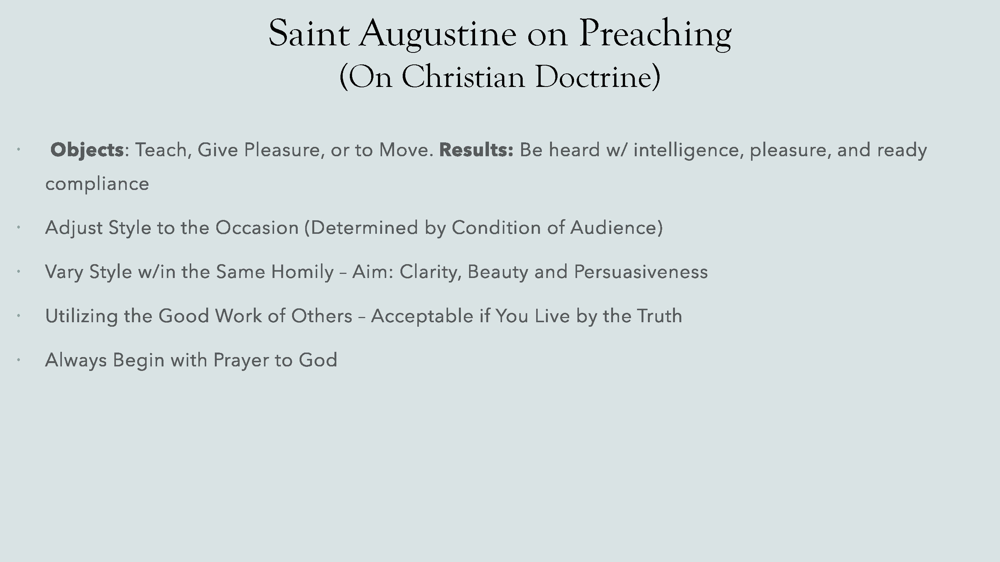
The phrase "rhetoric is to the mind what a kidnapper is to the body" is a conceptual paraphrase of the ancient Greek sophist Gorgias's views on persuasion, rather than a direct, verbatim quote from his surviving works.

Gorgias was Sophist -- Gorgias's View: He viewed this captive power of rhetoric as an awe-inspiring, almost magical force that could alter emotions and sway crowds

But perhaps someone is thinking that I have selected the Apostle Paul because he is our great orator.
For when he says, "Though I be rude in speech, yet not in knowledge, (2) he seems to speak as if granting so much to his detractors, not as confessing that he recognized its truth.
If he had said, "I am indeed rude in speech, but not in knowledge," we could not in any way have put another meaning upon it.
He did not hesitate plainly to assert his knowledge, because without it he could not have been the teacher of the Gentiles.
And certainly if we bring forward anything of his as a model of eloquence, we take it from those epistles which even his very detractors, who thought his bodily presence weak and his speech contemptible, confessed to be weighty and powerful

Metaphorical Associations: For what is there that sober ears could wish changed in this speech?
In the first place, the invective itself; with what vehemence it throws itself upon the drowsy senses to startle them into wakefulness: "Woe to you who are at ease in Zion, and trust in the mountains of Samaria, who are heads and chiefs of the people, entering with pomp into the house of Israel!"
Next, that he may use the favors of God, who has bestowed upon them ample territory, to show their ingratitude in trusting to the mountain of Samaria, where idols were worshipped: "Pass ye unto Calneh," he says, "and see; and from thence go ye to Hamath the great; then go down to Gath of the Philistines, and to all the best kingdoms of these: is their border greater than your border?"
At the same time also that these things are spoken of, the style is adorned with names of places as with lamps, such as "Zion," "Samaria," "Calneh," "Hamath the great," and "Gath of the Philistines."
Then the words joined to these places are most appropriately varied: "ye are at ease," "ye trust," "pass on," "go," "descend.“

Anaphora: The stylistic and rhetorical device used when a speaker begins consecutive phrases, clauses, or sentences with the same word—such as a pronoun—is called anaphora.
Pronounced uh-NAF-uh-ruh, it comes from a Greek phrase meaning "carrying up or back".
Purpose: Speakers and writers use anaphora to create rhythm, build emotional intensity, and make a point memorable.
Example with Pronouns: "I came, I saw, I conquered" or Winston Churchill's famous line, "We shall fight on the beaches, we shall fight on the landing grounds..."

The Danger of Eloquence not Rooted in Truth: Gorgias's View: rhetoric is to the mind what a kidnapper is to the body" is a conceptual paraphrase of the ancient Greek sophist Gorgias's views on persuasion.
He viewed this captive power of rhetoric as an awe-inspiring, almost magical force that could alter emotions and sway crowds.
As preachers, you have a powerful responsibility to speak that which is true.

Pray Before Preaching: he will succeed more by piety in prayer than by gifts of oratory; and so he ought to pray for himself, and for those he is about to address, before he attempts to speak.

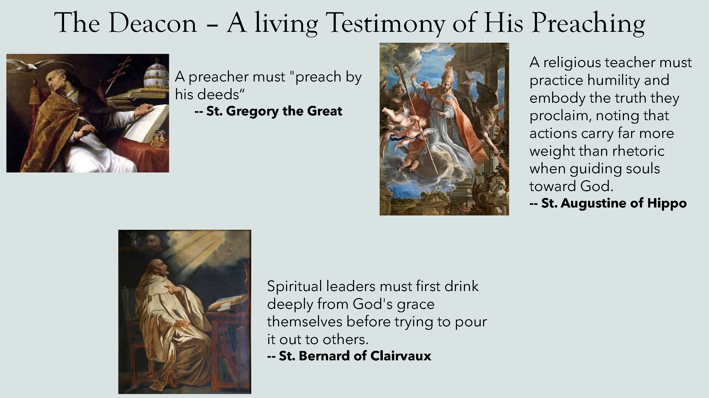
Endeavour with all diligence not to allow your living to contradict your preaching.
Remember, we are all called to be Saints. Just because you are a deacon….one of the Church’s clergy doesn’t mean that somehow you’ve arrived…to the contrary, you must redouble your efforts.
Make every effort to respond to the Gospel Call – “Be perfect as your Heavenly Father is perfect.”
The word perfect here means complete, mature, or more perfect.
It comes from the Greek word TEH-lei-os.
You will recall from your fundamental theology course that our Telos (final end) is God Himself…to know, love and possess God eternally in the beatific vision…To be Saints!
Live what you believe!!!

Sometimes as you prepare your homilies….actually almost always with me…I find it is written for me too.
Preach to yourself, but more importantly, respond.
If you don’t, you will find that the man who falls into hypocrisy will struggle greatly to even recover his earlier state.
As St. Thérèse of Lisieux discovered, we can’t achieve such perfection on our own….we need the assistance of God as He elevates us to knew heights in holiness…our job is to cooperate with that grace.

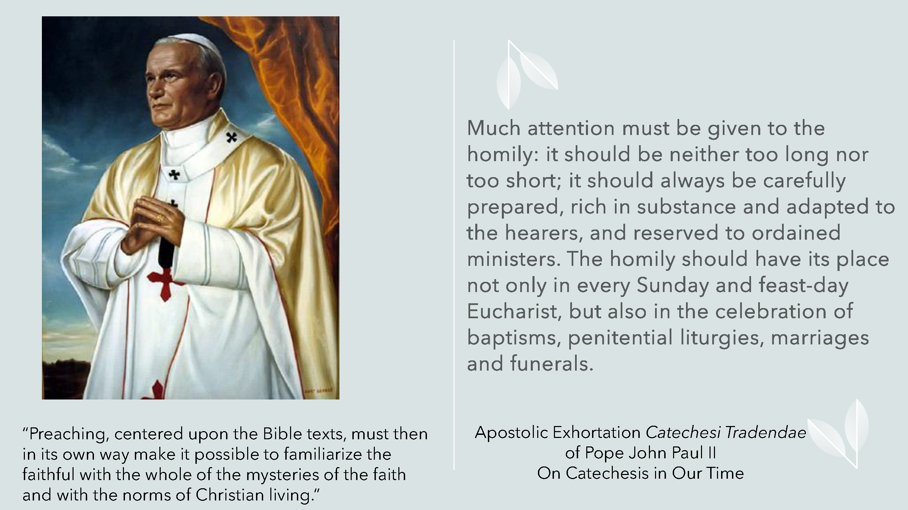
The clergy have been given the solemn responsibility to communicate the mysteries of our faith to the people of God in a way that speaks to their carrying forward the Light of Christ in their daily lives – to a world in desperate need of knowing Him.

We have been made for a specific purpose….not in the sense of fate, but rather in terms of a vocation. Consider 3:

    1. Telos: God desires that we be happy with Him in eternity

    2. Vocation in the common sense: clergy, religious, married life

    3. Day to day living: to live lives of heroic virtue as we interact with others that have been placed in our path.

Pope John Paul II said that it is man’s journey of discovery to learn his purpose in Christ.
For the Deacon, this purpose is integrally linked to their interaction with and service of the faithful to help them realize their vocation or purpose in life.
Your preaching should reflect that.
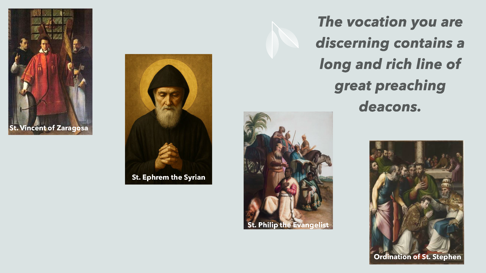
It is with great humility and thanksgiving that we follow in the line of many great deacons for our Church.
We should not soon forget this.

The homily is "part of the liturgical action", and is meant to foster a deeper understanding of the word of God, so that it can bear fruit in the lives of the faithful.
Hence ordained ministers must "prepare the homily carefully, based on an adequate knowledge of Sacred Scripture"

(Sacramentum Caritatis)
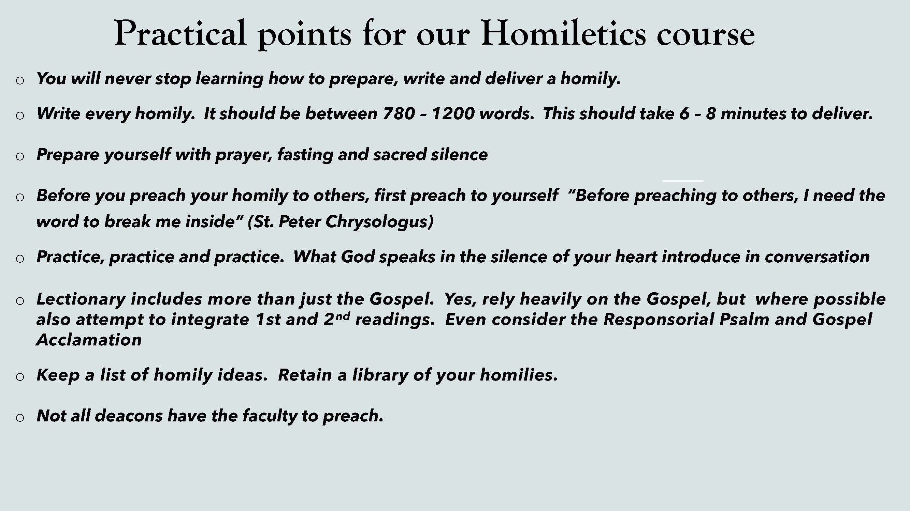
These are points we’ve put together for you to consider as your work to prepare future homilies and develop your preaching style.
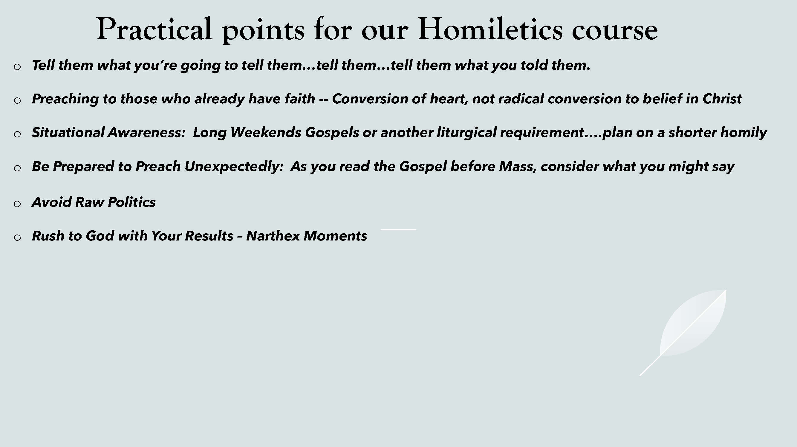
Avoid Raw Politics: Homily is not a speech or lecture.
No indorsement, campaigning, direction on voting or personal political views.
Okay to preach on fundamental moral principles (e.g., dignity of every human person).
The Church’s social principles are not themselves political ideology or party platforms.

People will tell you what a great homily you preached. How should you respond?

Bishop Golka – “what did you like about it?”

Fr. Rajeev: Hold out hands and offer praise up to God. “To God be the Glory” or “God is Good”

