# Deacon Dan's Presentation

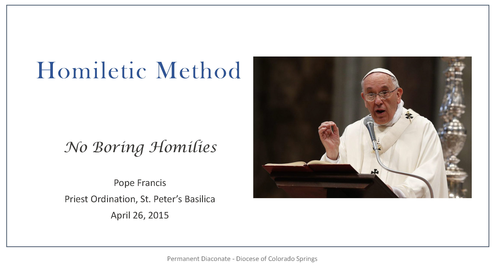
Ensure “that your homilies are not boring, that your homilies arrive directly in people’s hearts because they flow from your heart, because what you tell them is what you have in your heart.”

If you speak from your heart, your homilies will not be boring.

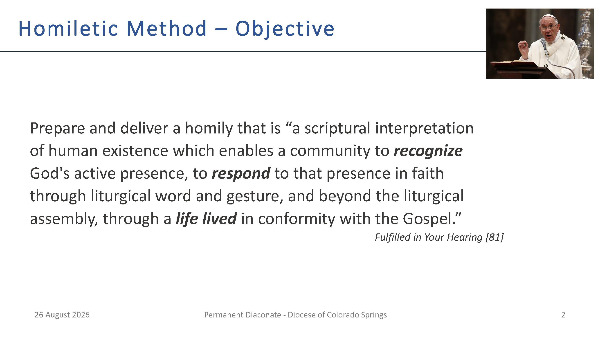
Our homilies should enable people to recognize God’s action in their lives, to draw them to Christ, and to inspire them to go forth to live the Gospel message.

Our homilies should flow from our hearts formed by our own unique perspective of living the Gospel message.

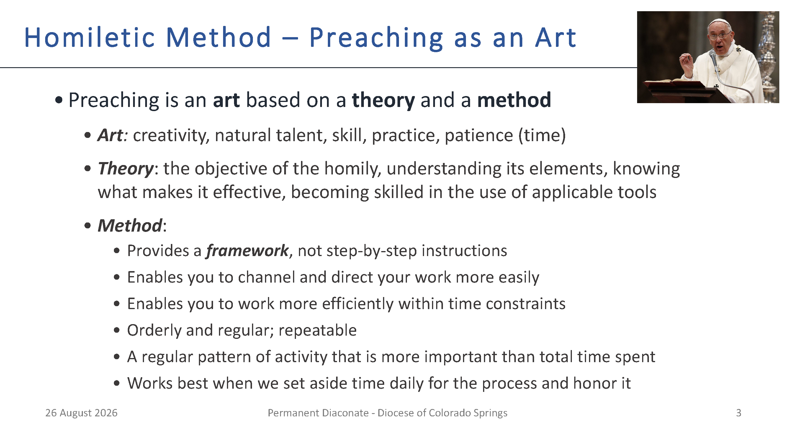
We do not all have the same natural talent.
We must have the humility to recognize that there will be others who are better preachers.

Yet, with practice, patience, and using the method, we can all become good preachers.

Don’t take shortcuts or skip elements of the process.

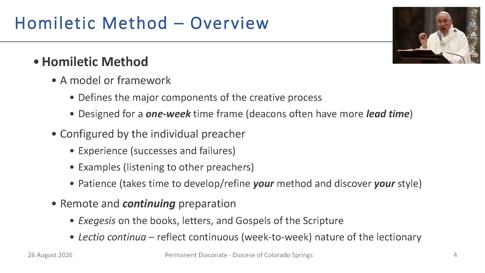
**One Week:**
If possible, don’t compress the process to less than a week.

I don’t recommend extending method across multiple weeks (can lose focus).

However, if too busy the week prior to preaching, you can prepare in earlier week (but review & practice prior to delivery)

**Takes Time:**

Preaching once a month at Sunday Mass extends the time it takes to discover and hone your style.

If possible, find opportunities to preach at daily Mass and communion services.

At 10 years a deacon, I have covered 110 of the possible 177 Sundays (62.15%).

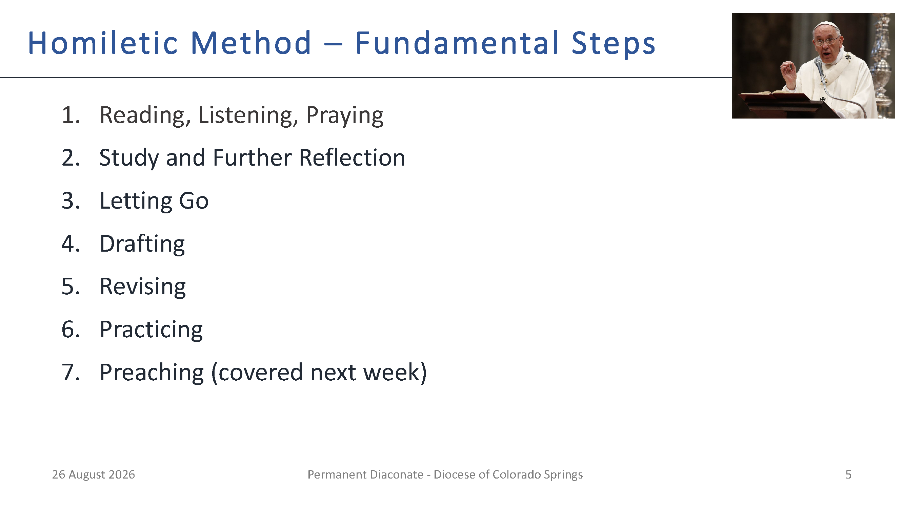
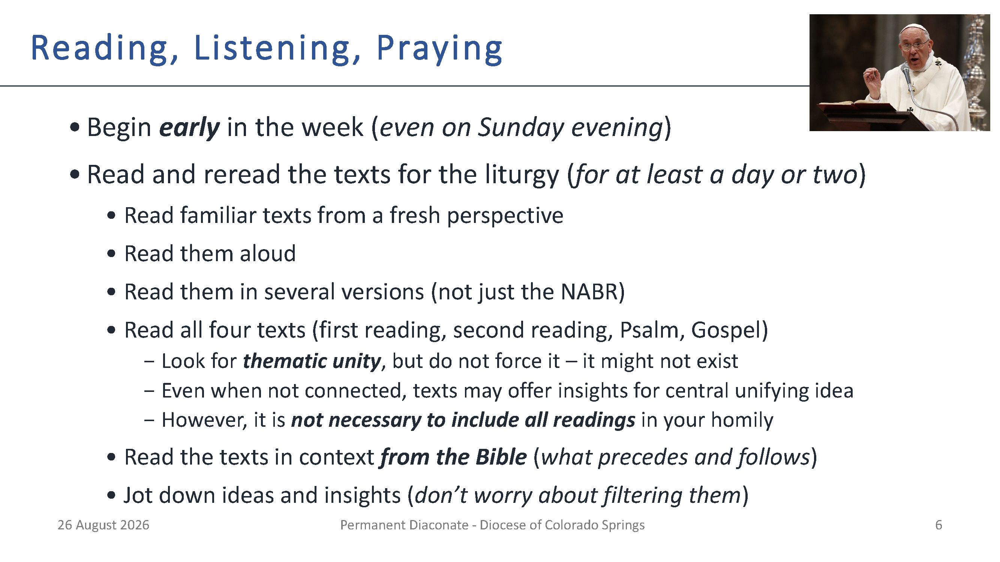
Reading just from the lectionary does not provide context and reading more than one translation can clarify meaning.
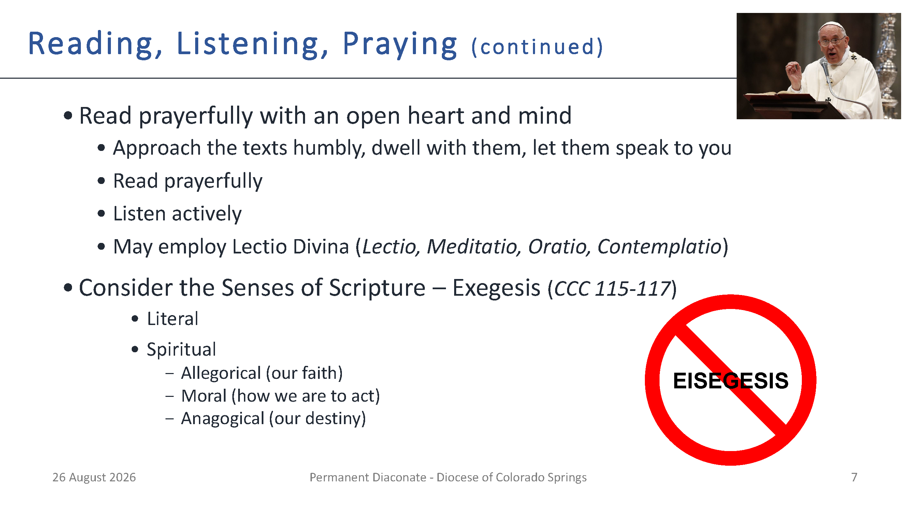
**Lectio Divina** (divine reading): during meditation, view text from various perspectives - it may help to imagine yourself in the scene.

Avoid **eisegesis** – reading into the Scripture to fit your ideas or your agenda.

**Senses of Scripture**

* Literal sense – the meaning conveyed by the words of Scripture and discovered by exegesis, following the rules of sound interpretation.

* Spiritual sense – the realities and events about which the Scripture speaks can be signs.

* The allegorical sense. - We can acquire a more profound understanding of events by recognizing their significance in Christ; thus, the crossing of the Red Sea is a sign or type of Christ’s victory and also of Christian Baptism.

* The moral sense. The events reported in Scripture ought to lead us to act justly.
As St. Paul says, they were written “for our instruction.”

* The anagogical sense (Greek: anagoge, “leading”). 
We can view realities and events in terms of their eternal significance, leading us toward our true homeland: thus, the Church on earth is a sign of the heavenly Jerusalem.

    The Letter speaks of deeds; Allegory to faith;

    The Moral how to act; Anagogy our destiny.
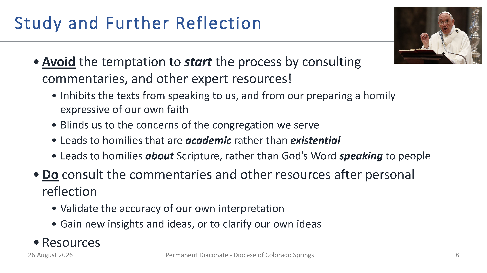
**Resources:**
Study Bibles (various versions/translations),

Didache Bible (NABR, RSV),

Homiletic Directory,

Commentaries (e.g., The New Jerome Biblical Commentary, Catena Aurea),

Lector Workbook, Living Liturgy,

Logos/Verbum, other online resources

Collect for the Mass

Scripture Summary from the Ordo

I am grateful when the Spirit comes to me, and I achieve that “ah ha” moment.

Unfortunately, He chooses to visit most often about 20 minutes after I go to bed.
I realize that He is probably always trying to reach me, but it is when I go to bed that my mind quiets down enough for me to feel his presence and listen to Him.
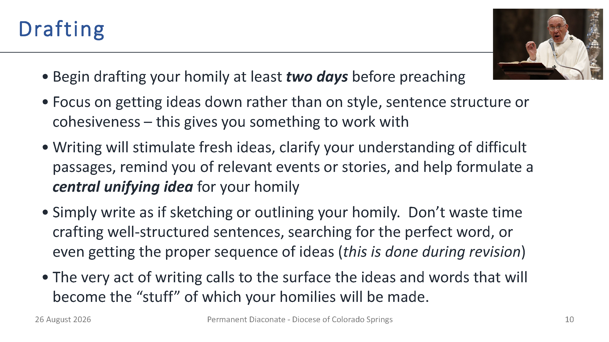
The amount of time may vary for you.  
Right after I was ordained, I tried to start writing too soon, leading to much rewriting. 
I am now comfortable waiting to write. 
If I have an entire Saturday available, I can write, revise and practice in that one day.

Leave yourself enough time for adequate revision.

Bullet 3: In formulating your homily avoid overly intellectual or theological or strong apologetic themes
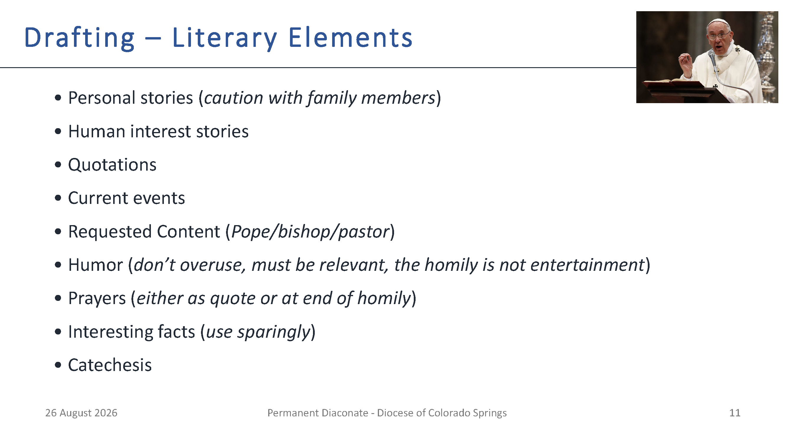
**Examples of requested content:** March 2019 Safe Haven Sunday, parish commitment weekend/stewardship

**Example prayer:** Feast of Holy Family - ended with prayer by Pope Francis at December 2013 Angelus Message prior to 2014 Synod on the Family.

**Example fact:**  Specifying the approximate amount of water turned into wine at Cana – 945 bottles

**Example fact:**  In 2019, we heard 6th, 7th and 8th Sundays in ordinary time – previously heard in 2010, 2007, 2001, respectively.

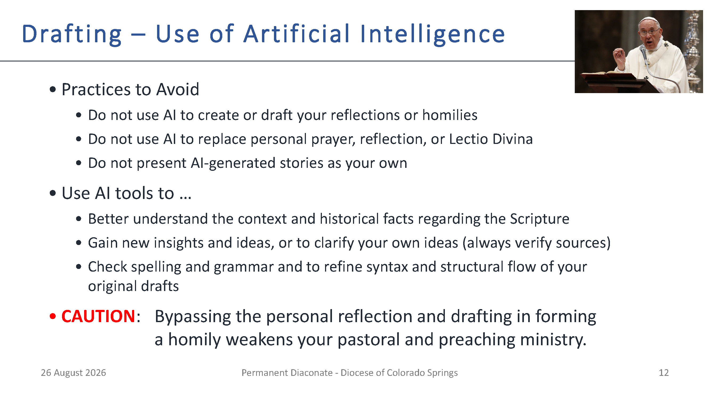
Be careful when using AI.
Verify the sources.
Verify consistency with Church teaching.
Try Magisterium AI.
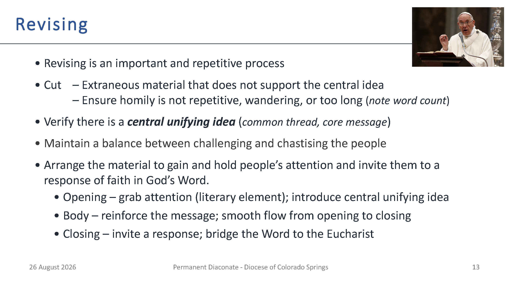
Repetition of the theme/core message is desirable

Why write and spend time revising a homily?

1) Stimulate and organize ideas, keep homily on point, keep it to length

2) Can be used during preaching

3)Have a record in case someone reports something you said to the Bishop
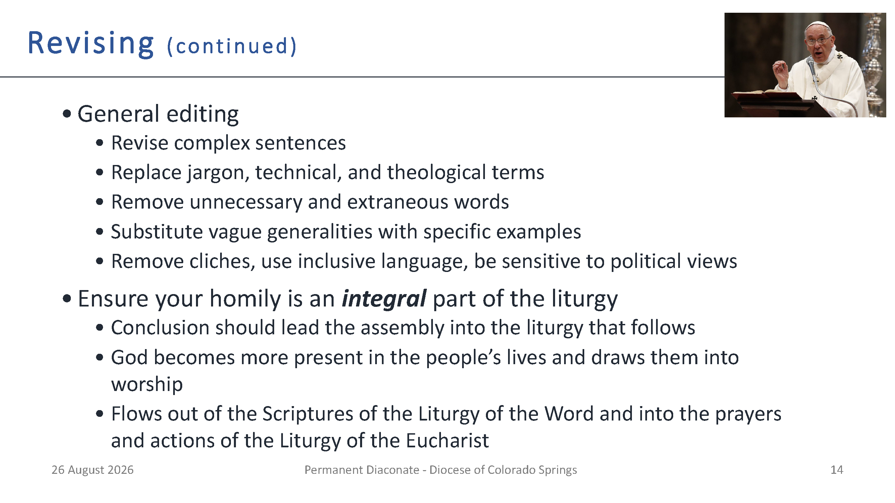
**Inclusive Language:** 
Dear Brothers and Sisters rather than Dear Brethren.
Don’t assume all women are stay-at-home moms.
Yet, avoid cumbersome constructs like he/she.
Also, we don’t acknowledge gender fluidity or non-binary gender.

During general editing, I often use the “Read Aloud” feature of Word to help clarify the text and find missing words that my mind fills in when I read the text.
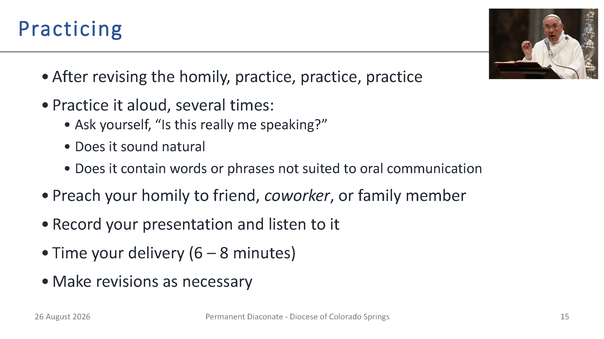
I find it useful, if I have time, to take breaks between practicing.

Do not plan to talk fast to fit a 2000-word homily into 8 minutes.

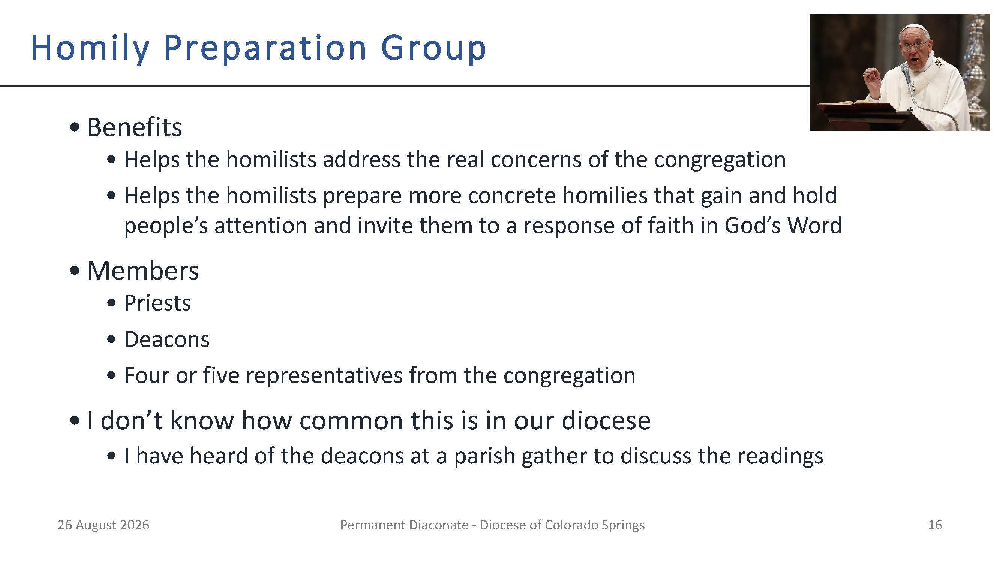
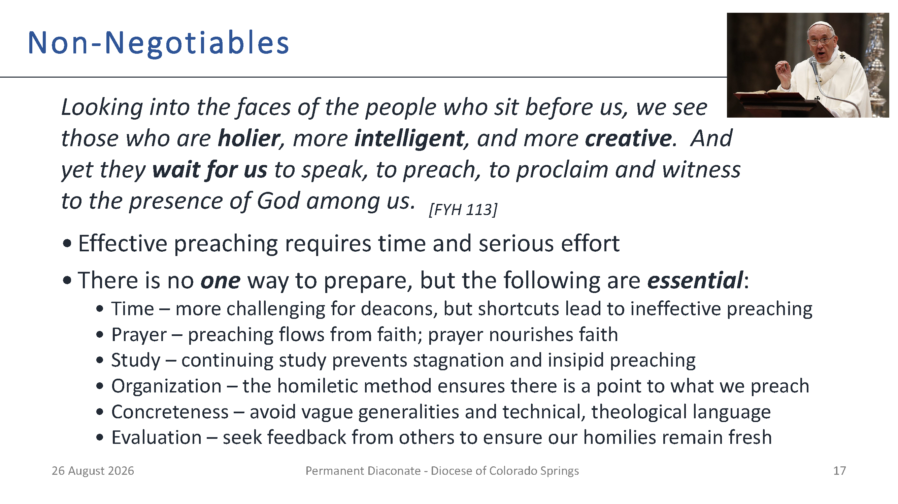
Take this responsibility seriously – through your words, you can draw people toward Christ or chase them away from the Church.
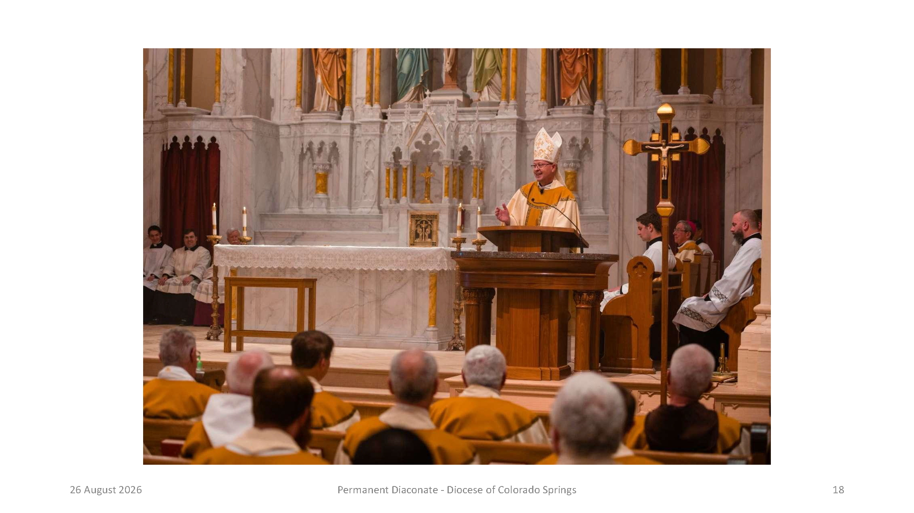
Bishop James Golka preaching at the 2022 Chrism Mass.
