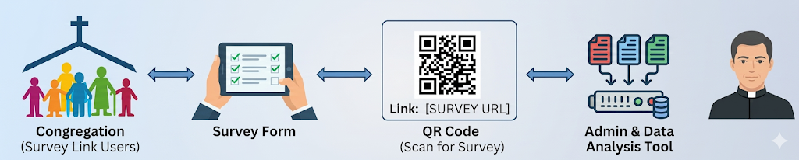
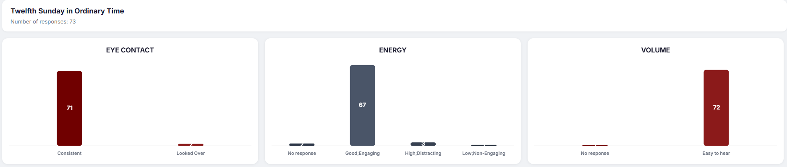
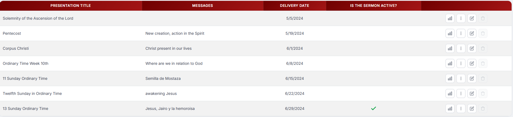
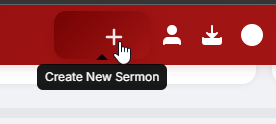
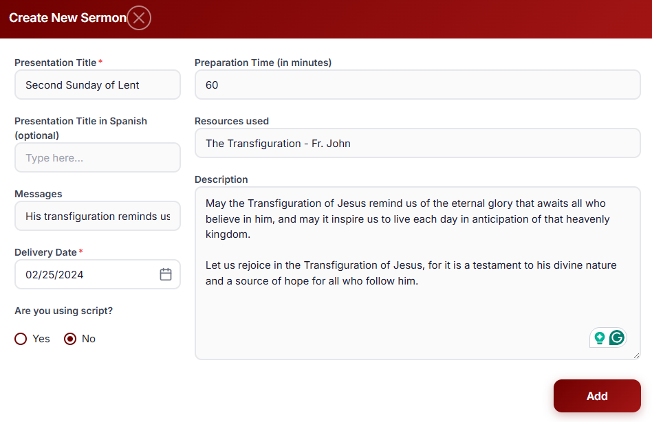
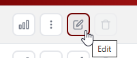

# CPI Admin Training Script

One of the unique aspects of this program is the opportunity to hear
directly from the people you serve. Using your unique QR code and URL
that you have received, congregants can quickly access a brief survey
and share their feedback after each sermon.

That feedback becomes the foundation for the insights and
recommendations you\'ll receive throughout the program, helping you
better understand how your message is being heard and experienced by
your congregation.

Let me explain how everything works.

When congregants scan the QR code, they'll be taken directly to the survey.
The QR code is connected to the presentation you've set up in the Admin
Tool. Within the Admin Tool, you'll be able to schedule your
presentations and manage information related to each sermon.

The purpose of the survey is to gather meaningful feedback from your
congregation so we can help you better understand how your preaching is
being received and identify opportunities for growth.

Before we look at the Admin Tool, let's take a quick look at the survey
itself.

*(Open test survey link and walk through the questions)*

<https://comppreaching.azurewebsites.net/?QR=1234>

## Messages Question

One question you\'ll notice asks congregants what messages they heard
during the sermon.

This question connects directly to a field you'll complete when setting
up a presentation in the Admin Tool. When creating a new presentation,
you'll enter the key messages you hope your congregation will hear.

Later, when survey responses come in, we\'ll be able to compare your
intended messages with what congregants actually heard. This helps
identify how effectively your message is being communicated.

## "What Can the Preacher Do Better?" Question

You'll also notice a question asking what the preacher can do to
improve.

In your survey, this question will be personalized with your name. For
example:

_"What can Deacon Anthony do to be a better preacher?_

This provides an opportunity for congregants to offer specific and
constructive feedback.

## Admin Tool Demonstration

Now let's take a look at the Admin Tool itself.

## Login Page

When you access the Admin Tool, the first screen you'll see is the
login page.

We'll include the login link in your Participant Guide. You can use any
modern web browser---I'm using Chrome today, but the tool should work
well in most popular browsers.

If you ever experience issues accessing the tool or have questions as
you begin using it, please don't hesitate to reach out. We're here to
support you throughout the program.

To log in, simply enter the email address you used when applying for the
program.

For today's demonstration, I'll use a sample account:

<dcn.anthony.stone@duluthcatholic.org>

*(Log in)*

## Dashboard Overview

Once you've logged in, you'll arrive at the main dashboard, which is divided into three sections.

## Top Section: Survey Results

At the top, you'll see charts displaying survey responses collected
from your congregation.

Each chart represents a survey question and shows how respondents
answered. You can scroll through the charts to review all survey
questions.

If you hover over a bar, you'll see the number of respondents who
selected that answer.

For example, in the sermon structure question, you can see that 21
respondents selected \"Clear Theme.\"

*(Demonstrate 2--3 charts)*

**Middle Section: Open-Ended Feedback**

The middle section contains responses to the two open-ended questions:

-   \"In your own words, what messages did you hear today?\"

-   \"What can \[preacher name\] do to be a better preacher?\"

For simplicity, we've labeled these sections:

-   **Messages Heard**

-   **Feedback**

You can switch between these tabs to review all comments submitted by
your congregation.

**Bottom Section: Presentations**

The bottom section displays all presentations you've created.

Currently, this preacher has only one presentation, so let's add
another one and see how the process works.

**Adding a Presentation**

To create a new presentation, click the **plus (+)** icon in the
upper-right corner.

**Training Tip:** During this
demonstration, it's often helpful to use the theme or topic for your
upcoming Sunday sermon.

When creating a presentation, you'll enter information such as:

-   Sermon title or theme

-   Date of the sermon

-   Key messages you hope congregants will hear

This information helps provide context for the survey responses you'll
receive later.

**Editing and Deleting Presentations**

You can also edit existing presentations.

*(Demonstrate editing a presentation)*

To update a presentation, simply click the Edit icon next to the
presentation you'd like to modify.

**Deleting Presentations**

Presentations can only be deleted if no survey responses have been
collected yet.

In most cases, this means you'll only be able to delete future
presentations that have not yet been delivered.

**Understanding the Active Presentation**

Earlier, I mentioned the concept of an **Active Presentation**.

When congregants scan your QR code, they are automatically directed to
the presentation currently marked as active.

The good news is that you don't have to manage this manually.

When you create a presentation and enter the correct sermon date, the
system automatically activates that presentation when its scheduled date
arrives.

So your main responsibility is simply to enter the correct sermon date.
The system will handle the rest.

**Survey Report Reminder**

Two days after each sermon date, you'll receive an email reminder
encouraging you to log in and download your survey report.

*(Demonstrate downloading a report)*

These reports provide a snapshot of how your congregation responded and
can be useful for reflection and ongoing improvement.

**Advanced Analysis and Recommendations**

Once we've collected data from at least six presentations, additional
analysis and recommendations will become available within the Admin
Tool.

These insights will help identify patterns in your preaching over time,
highlight strengths, and suggest areas for continued growth.

The more data we collect, the more meaningful and personalized these
recommendations become.

**Final Encouragement**

Before we conclude, I'd like to encourage you to consistently create
presentations and review your survey results throughout the program.

The quality of the analysis depends on the amount of data available. The
more sermons you log and the more survey responses your congregation
provides, the more accurate and valuable the insights will be.

Think of each sermon as another data point that helps build a clearer
picture of your preaching strengths, growth opportunities, and overall
impact on your congregation.

Every sermon matters, and every response helps make the analysis
stronger.

Do you have any questions about the Admin Tool?

At this point, I'll hand things over to John, who will discuss ongoing
support and the second part of the program.
